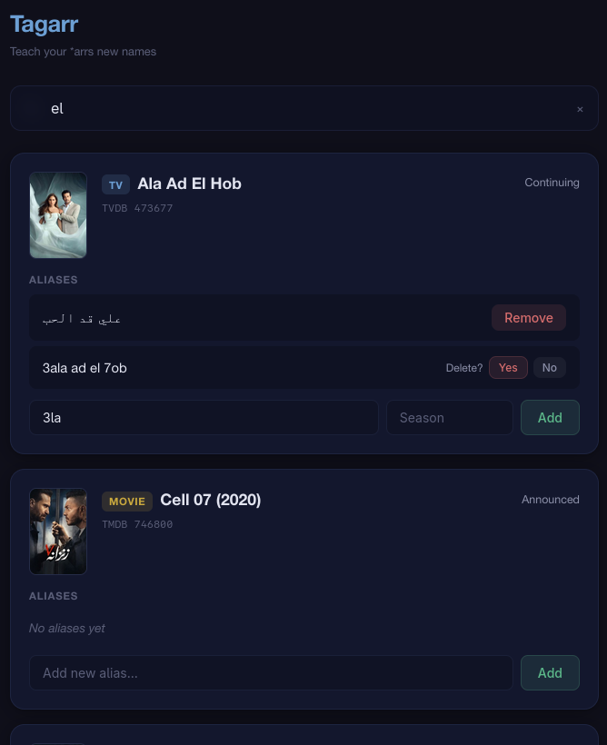

# Tagarr

**Teach your *arrs new names.**

Sonarr and Radarr match downloads to your library using title aliases, but sometimes a release uses a name they don't recognize — a transliteration, an alternate spelling, or a regional title. When that happens, the download just sits there unmatched.

Tagarr gives you a simple web UI to search your Sonarr and Radarr libraries and add custom aliases directly into their databases. No restart required — the *arrs pick up the new mappings immediately.



## Features

- **Unified search** across both Sonarr and Radarr libraries in one place
- **Add custom aliases** with a title and optional season number (Sonarr) so releases match correctly
- **Remove manual aliases** you no longer need — auto-imported aliases are protected and read-only
- **Works with either or both** — configure just Sonarr, just Radarr, or both
- **Poster art and metadata** displayed inline so you always know what you're editing
- **Zero dependencies on the *arr APIs** — reads and writes directly to the SQLite databases

## Setup

Tagarr runs as a Docker container alongside your existing Sonarr/Radarr setup. It needs read-write access to their database files.

### Docker Compose

```yaml
services:
  tagarr:
    image: ramymounir/tagarr:latest
    container_name: tagarr
    ports:
      - "5757:5757"
    volumes:
      - /path/to/sonarr/config:/data/sonarr
      - /path/to/radarr/config:/data/radarr
    environment:
      - PUID=1000
      - PGID=1000
      - SONARR_DB=/data/sonarr/sonarr.db
      - RADARR_DB=/data/radarr/radarr.db
    restart: unless-stopped
```

Replace `/path/to/sonarr/config` and `/path/to/radarr/config` with the actual paths to your Sonarr and Radarr config directories (the ones containing `sonarr.db` and `radarr.db`).

Either database can be omitted — if you only use Sonarr, just leave out the Radarr volume and environment variable.

### Environment Variables

| Variable | Description |
|---|---|
| `SONARR_DB` | Path to `sonarr.db` inside the container |
| `RADARR_DB` | Path to `radarr.db` inside the container |
| `PUID` | User ID for file permissions (default: `1000`) |
| `PGID` | Group ID for file permissions (default: `1000`) |

### Health Check

Tagarr exposes a `/health` endpoint that reports per-database status. The Docker image has a built-in health check that uses it.

## How It Works

Tagarr writes directly to the same SQLite tables that Sonarr and Radarr use for alias matching:

- **Sonarr**: Inserts into `SceneMappings` with `Type = "ManualMapping"` — the same format Sonarr uses for its own manual mappings
- **Radarr**: Inserts into `AlternativeTitles` with `SourceType = 2` — Radarr's marker for manually added titles

Title normalization (stripping articles, punctuation, and diacritics) mirrors the exact logic used internally by both apps, so aliases are matched the same way built-in titles are.

## Development

```bash
# Install dependencies
pip install flask gunicorn

# Run the dev server
flask --app app run --debug

# Build and run with Docker
docker compose up --build
```
